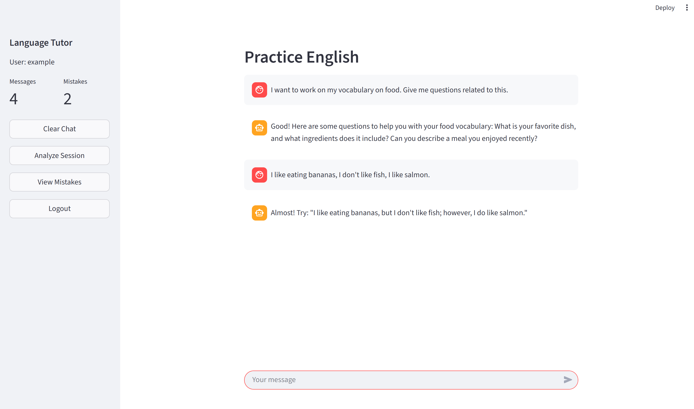

# 🎓 AI Language Tutor (Conversational RAG + Mistake Tracking)
**TL;DR:** Chat with an AI English tutor that corrects your mistakes, analyzes them, and tracks your progress — built with OpenAI, LangChain, and ChromaDB.

An intelligent language learning platform that helps students practice English through real-time conversation while tracking mistakes for personalized learning insights.

> **⚠️ Development Status:** This project is under active development. Core features are functional, with advanced capabilities planned for future releases.

## 🌟 Features

### Currently Implemented ✅

- **Real-time Conversational Practice**: Interactive chat with an AI tutor that gently corrects grammar and vocabulary mistakes
- **Intelligent Mistake Analysis**: Post-session analysis using OpenAI's Structured Outputs to identify and categorize errors
- **Persistent Mistake Tracking**: Vector-based storage using ChromaDB for semantic search and pattern recognition
- **Error Classification**: Automatically categorizes mistakes by type (grammar, spelling, vocabulary), difficulty, and concepts
- **Interactive Web Interface**: Clean Streamlit-based UI with login, chat history, and mistake review
- **Session Analytics**: View detailed breakdowns of mistakes with explanations and corrections

### In Development 🚧

- **Topic Memory System**: Track concepts covered during learning sessions
- **Progress Reports**: Visual analytics showing improvement over time
- **Spaced Repetition**: Intelligent reminders to practice problematic concepts
- **Test Generation**: Auto-create practice exercises based on mistake patterns
- **Multi-language Support**: Expand beyond English tutoring
### 🧩 Why It's Different
Unlike generic chatbots, this system:
- Uses structured JSON outputs (no parsing errors)
- Stores mistakes in vector space for semantic retrieval
- Learns your weak spots over time

## 🏗️ Architecture

conversational-rag/
├── app/
│ ├── llm_client.py # OpenAI API wrapper
│ ├── conversation/
│ │ └── conversation_analyzer.py # Post-session mistake detection
│ └── memory/
│ ├── mistake_memory.py # Chroma vector storage
│ └── short_term_memory.py # In-session state management
├── frontend/
│ └── app.py # Streamlit UI
├── tests/
│ ├── test_conversation_analyzer.py
│ └── test_mistake_memory.py
└── scripts/
└── debug_analyzer.py # CLI testing utility

### Tech Stack

- **LLM**: OpenAI GPT-4o-mini with Structured Outputs (100% reliable JSON)
- **Vector DB**: ChromaDB with OpenAI embeddings
- **Framework**: LangChain for LLM orchestration
- **Frontend**: Streamlit for rapid prototyping
- **Testing**: pytest with 16 passing unit tests
- **Language**: Python 3.12+

## 🚀 Quick Start

### Prerequisites

- Python 3.12 or higher
- OpenAI API key
- Virtual environment (recommended)

### Installation

Clone the repository
git clone https://github.com/yourusername/ai-language-tutor.git
cd conversational-rag

Create virtual environment
python -m venv venv
source venv/bin/activate # On Windows: venv\Scripts\activate

Install dependencies
pip install -r requirements.txt

Set up environment variables
cp .env.example .env

Edit .env and add your OPENAI_API_KEY
text

### Running the Application

Start the Streamlit interface
streamlit run frontend/app.py

Login credentials (demo):
Username: example
Password: example
text

### Testing

Run all tests
pytest tests/ -v

Test conversation analyzer
pytest tests/test_conversation_analyzer.py -v

Test mistake memory
pytest tests/test_mistake_memory.py -v

Debug script (no UI)
python scripts/debug_analyzer.py

text

## 💬 Usage Example

1. **Login** with demo credentials (example/example)
2. **Start chatting** in English - try making intentional mistakes:
   - "I eat bananas with mie families"
   - "She go to work every day"
   - "I have went there yesterday"
3. **Click "Analyze Session"** to see detected mistakes
4. **Review corrections** with explanations and grammar concepts
5. **View mistake history** to track your learning patterns

## 🔬 How It Works

### 1. Real-time Tutoring
- User sends message to chatbot
- LLM responds with gentle corrections and explanations
- Conversation stored in short-term memory (RAM)

### 2. Post-Session Analysis
- User clicks "Analyze Session"
- `ConversationAnalyzer` processes entire conversation with GPT-4o-mini
- Uses Pydantic schemas to guarantee valid JSON output
- Identifies: error type, corrected version, explanation, concepts, difficulty

### 3. Persistent Storage
- Mistakes stored in ChromaDB with vector embeddings
- Enables semantic search: "Find similar verb conjugation errors"
- Metadata allows filtering by error type, difficulty, date

### 4. Learning Insights
- View all mistakes with corrections
- Track error patterns over time
- Identify areas needing practice

## 📊 Project Status

| Component | Status | Test Coverage |
|-----------|--------|---------------|
| Conversation Analyzer | ✅ Complete | 7/7 tests passing |
| Mistake Memory | ✅ Complete | 9/9 tests passing |
| Short-term Memory | ✅ Complete | N/A (simple) |
| Streamlit UI | ⚠️ Beta | Manual testing |
| Documentation | 🚧 In Progress | N/A |
| Deployment | 📅 Planned | N/A |

## 🗺️ Roadmap

### Phase 1: MVP (Current)
- [x] Real-time chat interface
- [x] Mistake detection and analysis
- [x] Persistent storage with semantic search
- [x] Basic unit tests
- [ ] Complete documentation
- [ ] UI polish

### Phase 2: Enhanced Features
- [ ] Topic tracking memory (separate concepts DB)
- [ ] Progress analytics dashboard
- [ ] Automatic test generation
- [ ] Export learning reports (PDF)

### Phase 3: Production Ready
- [ ] User authentication system
- [ ] Multi-user support with isolated data
- [ ] Rate limiting and cost controls
- [ ] Docker containerization
- [ ] Cloud deployment (AWS/Hugging Face)

### Phase 4: Advanced Capabilities
- [ ] Spaced repetition algorithm
- [ ] Voice interaction (speech-to-text)
- [ ] Multi-language support (Spanish, French, etc.)
- [ ] Integration with learning platforms

## 🧪 Key Design Decisions

1. **Structured Outputs over JSON Parsing**: Eliminates 100% of malformed JSON errors from LLM responses
2. **Batch Analysis vs Real-time**: Cost-efficient processing after conversation ends rather than per-message
3. **Vector Storage**: ChromaDB enables intelligent mistake retrieval and pattern recognition
4. **Streamlit for MVP**: Rapid prototyping without frontend framework complexity
5. **Pydantic Schemas**: Type safety and validation at LLM response layer

## 🤝 Contributing

This project is currently in active development. Contributions are welcome once the core architecture stabilizes. Please check back soon for contribution guidelines.

## 📝 License

MIT License - See LICENSE file for details

## 🙏 Acknowledgments

- OpenAI for GPT-4 and embeddings API
- LangChain for LLM orchestration framework
- Streamlit for rapid UI prototyping
- ChromaDB for vector storage

## 📧 Contact

For questions or feedback, please open an issue on GitHub.

---

**Note**: This is an educational project demonstrating AI-powered language learning. API costs apply when using OpenAI services. Estimated cost: ~$0.02 per tutoring session.
